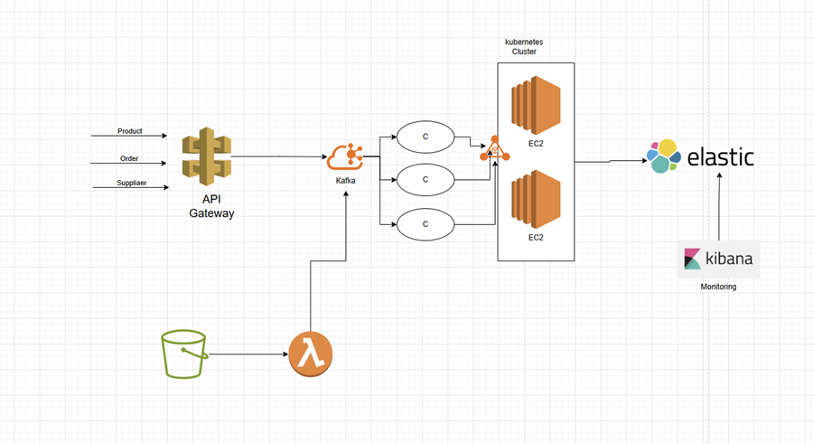
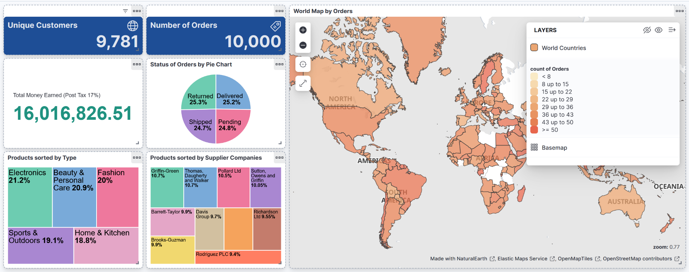
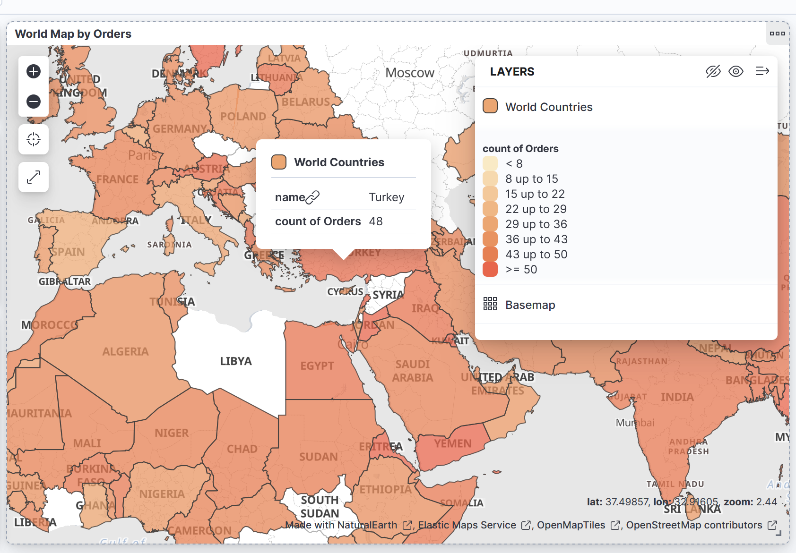
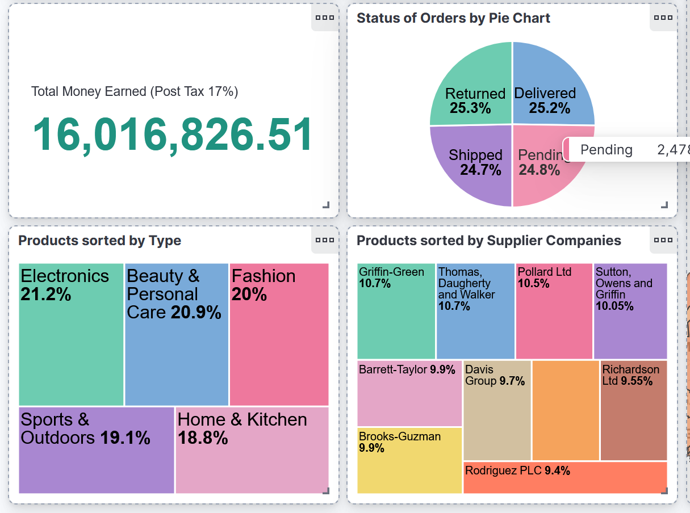

# DevOps Final Project - Event‑Driven Architecture & Observability (AWS + Kafka + K3s + Elastic)

This repository implements the **DevOps course final project**: an **event‑driven pipeline** on AWS using **Terraform**, **Kafka**, **Kubernetes (k3s on EC2)**, and the **Elastic Stack (Elasticsearch + Kibana)** for observability and analytics. 

---

## Architecture



### Event flow (two ingestion paths)

**1) API path**
1. Client sends `POST` to **API Gateway** (`/products`, `/orders`, `/suppliers`)
2. API Gateway → **Lambda (API Producer)**
3. Lambda forwards payload to an internal **Kafka REST Bridge** (running in Kubernetes)
4. Bridge publishes to **Kafka topics**
5. **Consumer workloads** (Kubernetes Deployments) consume and index documents into **Elasticsearch**
6. **Kibana** visualizes data (dashboard)

**2) S3 path**
1. Upload JSON file to **S3** 
2. S3 event → **Lambda (S3 Producer)**
3. Lambda forwards payload to the **Kafka REST Bridge**
4. Same Kafka → Consumers → Elasticsearch → Kibana flow

---

## Tech stack

- **AWS:** EC2, IAM, S3, API Gateway (HTTP API), Lambda, Security Groups 
- **IaC:** Terraform 
- **Kubernetes:** k3s 
- **Messaging:** Kafka 
- **Observability / Analytics:** Elasticsearch + Kibana

---

## Repository structure

```
.
├── main.tf                 # Infra + k3s bootstrap + platform manifests
├── variables.tf            # Terraform variables (ports, instance types, etc.)
├── output.tf               # Public endpoints and useful outputs
├── terraform.tfvars        # Project values (IP allowlist, deploy flag, key name)
├── export.ndjson           # Kibana saved objects (dashboard + data views)
├── generate-data.py        # Generates demo datasets
├── products.json
├── orders.json
├── suppliers.json
└── docs/
    └── screenshots/        # README images 
```

---

## Prerequisites

- AWS account + credentials configured locally (`aws configure`)
- Terraform **>= 1.5**
- An **EC2 key pair** already created in AWS (name must match `ssh_key_name`)
- Your public IP for `ssh_allowed_cidr` (recommended `/32`)
- (Optional) Python 3.x if you want to regenerate datasets

---

## Configuration

Edit `terraform.tfvars`:

```hcl
aws_region       = "eu-central-1"     # optional (default is eu-central-1)
ssh_key_name     = "MyKey-eu-central-1"
ssh_allowed_cidr = "YOUR_PUBLIC_IP/32"
deploy_platform  = true
```

Key variables (from `variables.tf`):
- `master_instance_type`, `worker_instance_type` — defaults are **large** (costly). For testing, you can switch to smaller types.
- `bridge_nodeport`, `kibana_nodeport`, `elasticsearch_nodeport` — NodePorts exposed on the master public IP.
- `deploy_platform` — if `true`, Terraform also deploys Kafka + consumers + Elasticsearch + Kibana.

---

## Deploy

```bash
terraform init
terraform plan
terraform apply
```

When apply finishes, Terraform prints outputs like:
- `k3s_master_public_ip`
- `bridge_url_public`
- `kibana_url_public`
- `elasticsearch_url_public`
- API Gateway base URL + route URLs
- `s3_bucket_name`

---

## Verify the system

SSH into the master:

```bash
ssh -i MyKey-eu-central-1.pem ubuntu@<k3s_master_public_ip>
```

Check cluster + workloads:

```bash
sudo k3s kubectl get nodes -o wide
sudo k3s kubectl -n platform get pods -o wide
sudo k3s kubectl -n platform get svc
```

Follow consumer logs (useful for debugging ingestion):

```bash
sudo k3s kubectl -n platform logs deploy/consumer -f
```

---

## Load data

### Option A — API Gateway (single record or list)

Send a full JSON object OR a JSON array (the Lambda accepts both):

```bash
curl -X POST "<http_api_products_url>"  -H "Content-Type: application/json" --data-binary @products.json
curl -X POST "<http_api_orders_url>"    -H "Content-Type: application/json" --data-binary @orders.json
curl -X POST "<http_api_suppliers_url>" -H "Content-Type: application/json" --data-binary @suppliers.json
```

### Option B — S3 upload (triggers S3 Lambda)

```bash
aws s3 cp products.json  s3://<s3_bucket_name>/products.json
aws s3 cp orders.json    s3://<s3_bucket_name>/orders.json
aws s3 cp suppliers.json s3://<s3_bucket_name>/suppliers.json
```

---

## Kibana dashboard (import + screenshots)

Open Kibana:

- `http://<k3s_master_public_ip>:<kibana_nodeport>`

Import the saved objects:

1. **Stack Management → Saved Objects → Import**
2. Import `export.ndjson`
3. Open dashboard: **“Project Dashboard”**

### Screenshots

**Kibana — Full dashboard**


**Kibana — World map (orders by country)**


**Kibana — Dashboard view (layout)**



---

## Cleanup

```bash
terraform destroy
```

---

## Authors

- Itay Margolin
- Evyatar Ben Avraham
